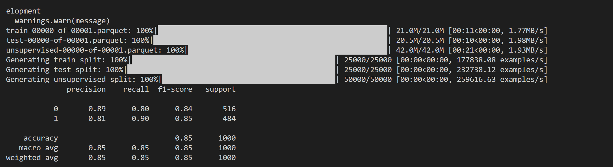
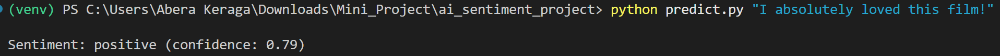
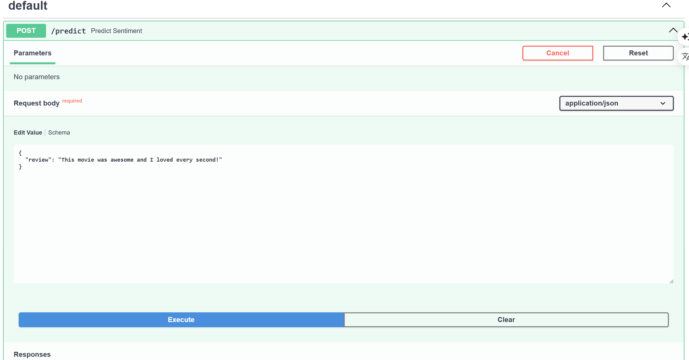
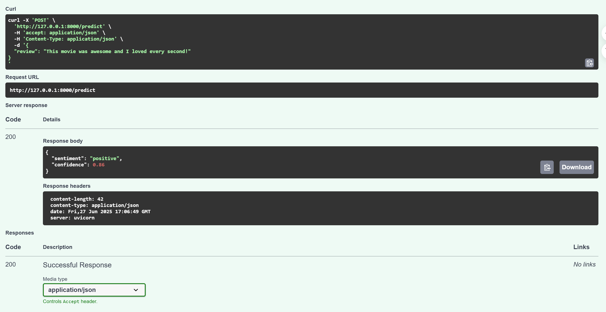

# Sentiment Classifier – Python AI Engineer Mini-Project

This project is a simple yet production-ready sentiment analysis pipeline built with:
- **Scikit-learn** for machine learning
- **TF-IDF** for text vectorization
- **FastAPI** for serving the model
- **IMDb dataset** via HuggingFace

---

##  Features

 Train a Logistic Regression model on IMDb reviews  
 Use TF-IDF to vectorize text  
 Predict sentiment from command-line OR HTTP API  
 Save and load models with `joblib`

---

## Installation

**1. Create a virtual environment (recommended):**
```bash
python -m venv venv
venv\Scripts\activate  
```
**2. Install dependencies:**
```bash
pip install -r requirements.txt
```
**3. Training the model:**

Run this command to train and save the model:
```bash
python train.py
```

It will:

Download and preprocess 5,000 IMDb samples

**Train a logistic regression model**
 
Save the model and TF-IDF vectorizer to the model/ folder

**5. Predict from CLI**

 


Predict from FastAPI

**- Start the API server:**

uvicorn app:app --reload

**- Open the interactive docs in browser:**

http://127.0.0.1:8000/docs

**- Example JSON body:**
 


**- Example API response:**
 

